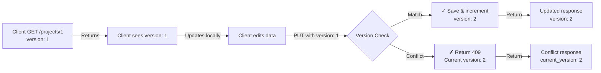

# Step 8: Optimistic Locking with Versioning ✅

## Summary

Implemented **versioning** system on Project and Space models to prevent lost updates in concurrent scenarios. Uses **optimistic locking** pattern with HTTP 409 Conflict response.

## Architecture

### Version Field
- Added `version = IntegerField(default=1)` to both Project and Space models
- Auto-incremented on each update
- Included in serializer responses (read-only)

### Optimistic Locking Flow

```
Client Update Request:
  1. GET /api/projects/1/
     → {id: 1, name: "...", version: 1}
  
  2. [Client makes local changes]
  
  3. PUT /api/projects/1/
     → {name: "new name", version: 1}
  
  Server Processing:
  ├─ Check: client_version (1) == db_version (1)?
  ├─ YES → Save & increment version → return {version: 2}
  └─ NO  → Return 409 Conflict + current version
```

## Flow Diagram



## Database Schema

### Project Model
```python
class Project(models.Model):
    name = CharField(max_length=255)
    description = TextField(blank=True)
    workspace = ForeignKey(Workspace, ...)
    version = IntegerField(default=1)  # NEW
    created_at = DateTimeField(auto_now_add=True)
    updated_at = DateTimeField(auto_now=True)
```

### Space Model
```python
class Space(models.Model):
    name = CharField(max_length=255)
    description = TextField(blank=True)
    project = ForeignKey(Project, ...)
    width = DecimalField(...)
    length = DecimalField(...)
    version = IntegerField(default=1)  # NEW
    created_at = DateTimeField(auto_now_add=True)
    updated_at = DateTimeField(auto_now=True)
```

## API Responses

### GET - Retrieve with Version
```bash
GET /api/projects/3/
Authorization: Token abc123def456...
```

**Response (200 OK)**
```json
{
  "id": 3,
  "name": "Sample Project 3",
  "description": "...",
  "workspace": 1,
  "version": 1,
  "created_at": "2026-06-17T08:01:00Z",
  "updated_at": "2026-06-17T08:01:00Z"
}
```

### PUT - Update with Version Check

#### Scenario 1: Correct Version (Success)

```bash
PUT /api/projects/3/
Authorization: Token abc123def456...
Content-Type: application/json

{
  "name": "Updated Name",
  "version": 1
}
```

**Response (200 OK)**
```json
{
  "id": 3,
  "name": "Updated Name",
  "description": "...",
  "version": 2
}
```

#### Scenario 2: Stale Version (Conflict)

```bash
PUT /api/projects/3/
Authorization: Token abc123def456...
Content-Type: application/json

{
  "name": "Another Update",
  "version": 1
}
```

**Response (409 Conflict)**
```json
{
  "error": "Version conflict. Resource has been modified.",
  "current_version": 2,
  "client_version": 1,
  "resource": {
    "id": 3,
    "name": "Updated Name",
    "version": 2
  }
}
```

## Test Results

### Project Versioning ✅

```
[Test 1] Initial retrieval
  Project ID: 3
  Version: 1

[Test 2] Update with correct version (1)
  Request: PUT with version: 1
  Response: version incremented to 2 ✓

[Test 3] Update with stale version (1)
  Request: PUT with version: 1 (but DB has 2)
  Response: 409 Conflict ✓
  Includes: current_version, client_version, resource
```

### Space Versioning ✅

```
[Test 1] Initial retrieval
  Space ID: 5
  Version: 1

[Test 2] Update with correct version (1)
  Request: PUT with version: 1
  Response: version incremented to 2 ✓

[Test 3] Update with stale version (1)
  Request: PUT with version: 1 (but DB has 2)
  Response: 409 Conflict ✓
```

## Implementation Details

### Views (core/views.py)

Both `ProjectViewSet` and `SpaceViewSet` override the `update()` method:

```python
def update(self, request, *args, **kwargs):
    """Override update to implement optimistic locking (versioning)."""
    instance = self.get_object()
    ensure_access(request, instance)
    
    # Get client version from request
    client_version = request.data.get('version')
    
    # If client provided a version, check it matches current
    if client_version is not None:
        try:
            client_version = int(client_version)
        except (ValueError, TypeError):
            return Response(
                {'error': 'version must be an integer'},
                status=status.HTTP_400_BAD_REQUEST
            )
        
        # Refresh from DB to get latest version
        instance.refresh_from_db()
        
        if client_version != instance.version:
            return Response(
                {
                    'error': 'Version conflict. Resource has been modified.',
                    'current_version': instance.version,
                    'client_version': client_version,
                    'resource': self.get_serializer(instance).data
                },
                status=status.HTTP_409_CONFLICT
            )
    
    # Perform the update
    partial = kwargs.pop('partial', False)
    serializer = self.get_serializer(instance, data=request.data, partial=partial)
    serializer.is_valid(raise_exception=True)
    
    # Increment version before saving
    instance.version += 1
    self.perform_update(serializer)
    
    return Response(serializer.data)
```

### Serializers (core/serializers.py)

Version field added as read-only:

```python
class ProjectSerializer(serializers.ModelSerializer):
    class Meta:
        model = Project
        fields = [
            'id', 'name', 'description', 'workspace',
            'version',  # NEW
            'created_at', 'updated_at'
        ]
        read_only_fields = [
            'id', 'created_at', 'updated_at',
            'workspace_name', 'workspace', 'version'  # version is read-only
        ]
```

## Client Implementation

### JavaScript/TypeScript Example

```typescript
// 1. Fetch resource
const response = await fetch('/api/projects/3/', {
  headers: { 'Authorization': `Token ${token}` }
});
const project = await response.json();

// 2. Update locally
project.name = 'New Name';

// 3. Send update with version
const updateResponse = await fetch('/api/projects/3/', {
  method: 'PUT',
  headers: {
    'Authorization': `Token ${token}`,
    'Content-Type': 'application/json'
  },
  body: JSON.stringify({
    name: project.name,
    version: project.version  // Include current version
  })
});

if (updateResponse.status === 409) {
  const conflict = await updateResponse.json();
  console.error('Conflict!', conflict.error);
  console.log('Current version:', conflict.current_version);
  console.log('Your version:', conflict.client_version);
  
  // Merge strategy:
  // Option 1: Refresh and retry
  // Option 2: Manual merge
  // Option 3: User intervention
} else {
  const updated = await updateResponse.json();
  console.log('Updated to version:', updated.version);
}
```

### cURL Examples

#### Get Project with Version
```bash
TOKEN="c573e1d8e4ebf51f3f10..."
curl -X GET http://localhost:8001/api/projects/3/ \
  -H "Authorization: Token $TOKEN" | jq '.version'
```

#### Update with Correct Version
```bash
curl -X PUT http://localhost:8001/api/projects/3/ \
  -H "Authorization: Token $TOKEN" \
  -H 'Content-Type: application/json' \
  -d '{"name": "Updated", "version": 1}' | jq '.version'
```

**Output:** `2` (incremented)

#### Update with Stale Version
```bash
curl -X PUT http://localhost:8001/api/projects/3/ \
  -H "Authorization: Token $TOKEN" \
  -H 'Content-Type: application/json' \
  -d '{"name": "Update", "version": 1}' | jq '.error'
```

**Output:** `"Version conflict. Resource has been modified."`

## Conflict Resolution Strategies

### 1. Retry (Simple)
```python
# Client-side
for attempt in range(3):
    try:
        response = update_project(project)
        return response
    except VersionConflict:
        # Refresh and retry
        project = get_project(project.id)
        project.name = "Updated Name"
```

### 2. Last-Write-Wins (Optimistic)
```python
# Just send current version without checking
# May lose intermediate updates but simple
```

### 3. Merge (Complex)
```python
# Manual merge of changes
fresh = get_project(project.id)
fresh.name = "merged name"
fresh.description = "my description"
update_project(fresh)
```

### 4. User Resolution (Best)
```python
# Show conflict to user
# Allow them to choose which version to keep
# Or merge manually
```

## Files Modified

```
core/models.py
  + version = IntegerField(default=1) to Project
  + version = IntegerField(default=1) to Space

core/serializers.py
  + 'version' field to ProjectSerializer
  + 'version' field to SpaceSerializer
  + 'version' in read_only_fields (prevents client from setting)

core/views.py
  + update() override in ProjectViewSet
  + update() override in SpaceViewSet
  + Version checking logic
  + 409 Conflict response

core/migrations/
  + 0003_project_version_space_version.py
```

## Benefits

✅ **Prevents Lost Updates** - Concurrent edits detected
✅ **No Locks** - Optimistic, not pessimistic
✅ **Scalable** - No database locks blocking readers
✅ **Client Aware** - Clients know when conflicts occur
✅ **Merge Friendly** - Clients can implement strategies

## Trade-offs

⚠️ **Requires Client Version Tracking** - Client must send version
⚠️ **Retry Logic Needed** - Clients must handle 409
⚠️ **Eventual Consistency** - Not instant but consistent

## Next Steps

1. ✅ Version fields added
2. ✅ Migration created and applied
3. ✅ Update methods override versioning logic
4. ✅ Tests verify 409 Conflict responses
5. ⏭️ Add versioning history/audit log (optional)
6. ⏭️ Add conflict resolution helper endpoints (optional)
7. ⏭️ Document client merge strategies

## Examples

### Scenario: Two Clients Update Same Project

```
Time  Client A                Client B          Database
─────────────────────────────────────────────────────────
t=0   GET /projects/1
      version: 1
      
t=1                           GET /projects/1
                              version: 1
                              
t=2   PUT /projects/1         
      name: "A's Name"
      version: 1
      
      ✓ 200 OK               
      version: 2              

t=3                           PUT /projects/1
                              name: "B's Name"
                              version: 1
                              
                              ✗ 409 Conflict
                              current_version: 2
                              
t=4                           GET /projects/1
                              version: 2
                              name: "A's Name"
                              
                              Merge/Retry/etc
```

## Status

✅ **COMPLETE** - Versioning system fully implemented and tested
